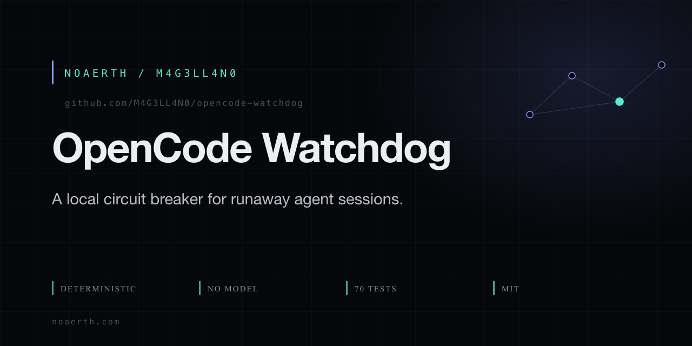

# OpenCode Watchdog

<p align="center">
  <picture>
    <source media="(prefers-reduced-motion: reduce)" srcset="assets/hero/hero-reduced.svg">
    <source media="(prefers-color-scheme: light)" srcset="assets/hero/hero-light.svg">
    
  </picture>
</p>

<p align="center">
  <picture>
    <source media="(prefers-reduced-motion: reduce)" srcset="assets/hero/computational-dark.svg">
    <source media="(prefers-color-scheme: light)" srcset="assets/hero/computational-light.svg">
    
  </picture>
</p>

<p align="center">
  
</p>

A local circuit breaker for runaway OpenCode sessions.

Public site: https://opencode-watchdog.vercel.app

Built by Noaerth.

OpenCode Watchdog is an independent community project by Noaerth. It is not affiliated with, endorsed by, or maintained by the OpenCode team.

## The problem

Models occasionally enter runaway repetition:

```
递归递归递归递递归...
```

OpenCode Watchdog notices the repetition and safely interrupts the affected session.

## 60-second quickstart

```bash
# Install from GitHub (npm package planned)
git clone https://github.com/M4G3LL4N0/opencode-watchdog.git
cd opencode-watchdog
pnpm install
pnpm run build

# Start the watchdog (adopts or spawns the OpenCode server)
./bin/ocw.js start

# Then connect your Desktop or CLI to the watchdog's OpenCode server
# (see `ocw desktop` and `ocw cli` for details)
```

## What it catches

- repeated-token generation
- repeated sentence/narration loops
- repeated tools with no progress
- no-progress activity

## What it does

Normal:
OpenCode → model → progress

Broken:
OpenCode → model degenerates → watchdog detects → affected session aborts → files remain

## Modes

- **Observe**: Log incidents, take no action (default, safe for evaluation)
- **Protect**: Abort affected session on detection (recommended for protection)
- **Recover**: Abort then send a recovery prompt (experimental, bounded)

## Why it's safe

- No model used for detection (purely local, deterministic)
- Local-only execution (no network calls except to your OpenCode server)
- Bounded buffers and per-session isolation
- No Git reset/revert or filesystem rollback
- Does not kill Desktop or unrelated sessions
- Conservative false-positive strategy (requires corroboration)

## Verification

- **70/70 unit tests** passing
- **22/22 simulate fixtures** passing (9 positive + 13 negative)
- Build and typecheck: clean (strict TypeScript)
- Live smoke tested against real `opencode serve` 1.18.30 (adopt/spawn/stop/refusal, status/doctor/sessions/mode/incidents)

## Architecture

```
Desktop / CLI
    ↓ (SSE feed)
OpenCode Server
    ↓
Watchdog Observer
    ↓
Detector Pipeline (short_pattern, duplicate_sentence, etc.)
    ↓
Policy Engine (corroboration threshold)
    ↓
Session Abort (POST /session/{id}/abort) or Recovery Prompt
```

## Advanced usage

See `ocw --help` for the full command list:

```
ocw start [--mode observe|protect|recover]   Start (or adopt) the shared OpenCode server and watch all sessions
ocw desktop [--mode ...]                     Same as start, then print Desktop connection instructions
ocw cli                                      Connect your terminal CLI to the running shared server
ocw run [args...]                            Pass-through to 'opencode run' attached to the shared server
ocw watch                                    Watch an already-running OpenCode server (no server management)
ocw stop                                     Stop a server this watchdog started (never external servers)
ocw status                                    Show watchdog + server + per-session circuit state
ocw doctor                                    Run capability probes and report health
ocw incidents [--json]                       Show the incident log
ocw incidents mark <id> false-positive       Tag an incident as a false positive
ocw stats                                    Report session + incident summary
ocw sessions [--json]                        List server sessions with circuit state
ocw mode [observe|protect|recover]           Show or set the action mode (observe-first onboarding)
ocw session reset <sessionID>                Reset watchdog state for a session (breaker + recovery + detectors)
ocw config                                    Show effective configuration
ocw config set <key> <value>                 Persist a configuration value
ocw simulate [fixture...] [--mode M] [--pace MS]  Run fixture scenarios through the detector engine
ocw install [--prefix DIR]                   Symlink the ocw launcher into a bin dir (~/.local/bin)
```

## Privacy

- All processing is local to your machine.
- Credentials (if set) are read from environment and never logged.
- No data is sent to external services.

## Contributing

See [CONTRIBUTING.md](CONTRIBUTING.md).

## License

[MIT](LICENSE) © 2026 Noaerth

Built by Noaerth.

<!-- TRILLIONX:presentation:begin -->

### Animated surfaces

Generated from this repository's own source tree: every count, route and module below was measured, not written by hand.

#### Identity

<picture>
  <source media="(prefers-reduced-motion: reduce)" srcset="https://raw.githubusercontent.com/M4G3LL4N0/opencode-watchdog/main/.github-art/surfaces/hero-reduced.svg">
  <source media="(prefers-color-scheme: light)" srcset="https://raw.githubusercontent.com/M4G3LL4N0/opencode-watchdog/main/.github-art/surfaces/hero-light.svg">
  
</picture>

#### Entry points

<picture>
  <source media="(prefers-reduced-motion: reduce)" srcset="https://raw.githubusercontent.com/M4G3LL4N0/opencode-watchdog/main/.github-art/surfaces/terminal-reduced.svg">
  <source media="(prefers-color-scheme: light)" srcset="https://raw.githubusercontent.com/M4G3LL4N0/opencode-watchdog/main/.github-art/surfaces/terminal-light.svg">
  
</picture>

#### Modules

<picture>
  <source media="(prefers-reduced-motion: reduce)" srcset="https://raw.githubusercontent.com/M4G3LL4N0/opencode-watchdog/main/.github-art/surfaces/architecture-reduced.svg">
  <source media="(prefers-color-scheme: light)" srcset="https://raw.githubusercontent.com/M4G3LL4N0/opencode-watchdog/main/.github-art/surfaces/architecture-light.svg">
  
</picture>

#### Primitives

<picture>
  <source media="(prefers-reduced-motion: reduce)" srcset="https://raw.githubusercontent.com/M4G3LL4N0/opencode-watchdog/main/.github-art/surfaces/state_machine-reduced.svg">
  <source media="(prefers-color-scheme: light)" srcset="https://raw.githubusercontent.com/M4G3LL4N0/opencode-watchdog/main/.github-art/surfaces/state_machine-light.svg">
  
</picture>

#### Build and tests

<picture>
  <source media="(prefers-reduced-motion: reduce)" srcset="https://raw.githubusercontent.com/M4G3LL4N0/opencode-watchdog/main/.github-art/surfaces/build-reduced.svg">
  <source media="(prefers-color-scheme: light)" srcset="https://raw.githubusercontent.com/M4G3LL4N0/opencode-watchdog/main/.github-art/surfaces/build-light.svg">
  
</picture>

#### Workflow

<picture>
  <source media="(prefers-reduced-motion: reduce)" srcset="https://raw.githubusercontent.com/M4G3LL4N0/opencode-watchdog/main/.github-art/surfaces/workflow-reduced.svg">
  <source media="(prefers-color-scheme: light)" srcset="https://raw.githubusercontent.com/M4G3LL4N0/opencode-watchdog/main/.github-art/surfaces/workflow-light.svg">
  
</picture>

#### Domain

<picture>
  <source media="(prefers-reduced-motion: reduce)" srcset="https://raw.githubusercontent.com/M4G3LL4N0/opencode-watchdog/main/.github-art/surfaces/domain-reduced.svg">
  <source media="(prefers-color-scheme: light)" srcset="https://raw.githubusercontent.com/M4G3LL4N0/opencode-watchdog/main/.github-art/surfaces/domain-light.svg">
  
</picture>

#### Identity object

<picture>
  <source media="(prefers-reduced-motion: reduce)" srcset="https://raw.githubusercontent.com/M4G3LL4N0/opencode-watchdog/main/.github-art/surfaces/footer-reduced.svg">
  <source media="(prefers-color-scheme: light)" srcset="https://raw.githubusercontent.com/M4G3LL4N0/opencode-watchdog/main/.github-art/surfaces/footer-light.svg">
  
</picture>

<!-- TRILLIONX:presentation:end -->

<!-- TRILLIONX:evidence:begin -->

## What is measurable here

Generated by `.github-art` from the source tree at publish time.

| Signal | Value |
| --- | --- |
| HTTP routes | 0 |
| Entry points | 1 |
| Module roots | 3 |
| Test files | 12 |
| CI workflows | 1 |
| Distinctive stack | scaffold only |
| Status | LIVE |
| Evidence confidence | E3 |
| Animated surfaces | 8 |

<!-- TRILLIONX:evidence:end -->
